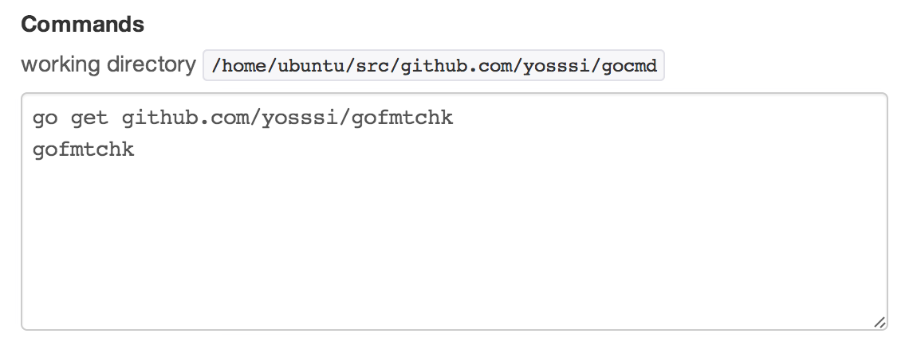

# gofmtchk - Format check tool in Go

gofmtchk is a tool for checking if the specific package's go files are formatted by `gofmt` command.

## Installation

	$ go get github.com/yosssi/goftmchk

## Execution

Change the current directory to the your go package path.

	$ cd your-go-package-path

Execute the `gofmtchk` binary file.

	$ your-go-workspace-path/bin/gofmtchk

Or, if you added the your go workspace's bin directory on PATH, you can execute simply the following command.

	$ gofmtchk

If there are go files that have to be formatted, the following message would be shown.

	The following go files have to be formatted:

	./file1.go
	./file2.go
	./sub1/file3.go
	./sub1/sub2/file4.go

## Integration on drone.io

You can check if the specific package's go files are formatted automatically by integrating gofmtchk on [drone.io](https://drone.io). You can integrate gofmtchk on drone.io by setting the following commands:

	go get github.com/yosssi/gofmtchk
	gofmtchk

